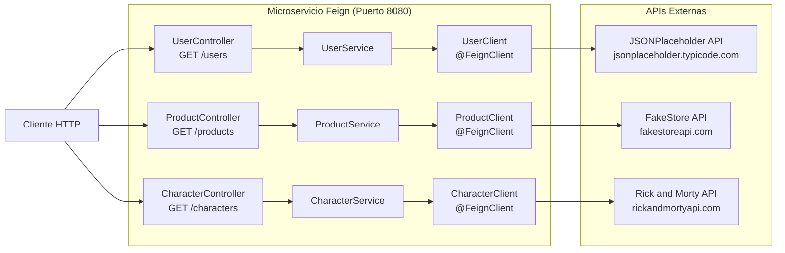

# T1-FeignGrupo1 - Clientes OpenFeign

Evaluacion T1 del curso **Desarrollo de Aplicaciones Web II**  
Instituto Superior Tecnologico Cibertec  
Grupo 1

---

## Integrantes del Grupo

| N° | Apellidos y Nombres | Grupo |
|:--:|---------------------|:-----:|
| 1 | Chaupis Alvarez Jhonny Samuel | 1 |
| 2 | Hinojosa Cano Carlos Daniel | 1 |
| 3 | Hurtado Sernaque Brayan Luis | 1 |
| 4 | Alayo Oliveros Mathias Miller | 1 |

---

## Descripcion del Proyecto

El proyecto implementa un microservicio en Spring Boot para el consumo declarativo de APIs REST externas mediante Spring Cloud OpenFeign. La aplicacion expone tres endpoints correspondientes a las preguntas de la Evaluacion T1, procesando y filtrando los datos obtenidos con la API Stream de Java.

---

## Entorno y Requisitos Tecnicos

- **Lenguaje:** Java 25
- **Framework:** Spring Boot 4.1.1
- **Spring Cloud:** 2025.1.3
- **Librerias principales:** Spring Cloud OpenFeign, Spring Web, Lombok
- **Gestor de construccion:** Apache Maven 3.9+ (o Maven Wrapper incluido)
- **Puerto de ejecucion:** 8080

---

## Detalle de Preguntas y Endpoints

### Pregunta 1: Consulta y Filtrado de Usuarios (JSONPlaceholder)

- **Endpoint expuesto:** `GET /users`
- **URL local:** `http://localhost:8080/users`
- **API externa consumida:** `https://jsonplaceholder.typicode.com/users`
- **Criterio de filtrado:**
  - `userId` debe ser un numero par (`userId % 2 == 0`).
  - `id` debe ser un numero impar (`id % 2 != 0`).
- **Componentes:**
  - `UserClient`: Interfaz `@FeignClient(name = "userClient", url = "https://jsonplaceholder.typicode.com")`.
  - `UserPlaceHolder`: DTO que mapea los campos de usuario de JSONPlaceholder.
  - `UserService`: Logica de negocio con filtrado mediante Stream.
  - `UserController`: Controlador REST que expone la ruta `/users`.

### Pregunta 2: Consulta y Filtrado de Productos (FakeStore API)

- **Endpoint expuesto:** `GET /products`
- **URL local:** `http://localhost:8080/products`
- **API externa consumida:** `https://fakestoreapi.com/products`
- **Criterio de filtrado:**
  - `price` estrictamente mayor a `50.0`.
  - `category` igual a `"electronics"` (comparacion insensible a mayusculas y minusculas).
- **Componentes:**
  - `ProductClient`: Interfaz `@FeignClient(name = "productClient", url = "https://fakestoreapi.com")`.
  - `ProductStoreDto`: DTO que mapea `id`, `title`, `price` y `category`.
  - `ProductService`: Logica de negocio con filtrado mediante Stream.
  - `ProductController`: Controlador REST que expone la ruta `/products`.

### Pregunta 3: Consulta y Filtrado de Personajes (Rick and Morty API)

- **Endpoint expuesto:** `GET /characters`
- **URL local:** `http://localhost:8080/characters`
- **API externa consumida:** `https://rickandmortyapi.com/api/character`
- **Criterio de filtrado (primera pagina de resultados):**
  - `status` igual a `"Alive"`.
  - `species` igual a `"Human"`.
- **Componentes:**
  - `CharacterClient`: Interfaz `@FeignClient(name = "characterClient", url = "https://rickandmortyapi.com/api")`.
  - `CharacterResponseRM`: Modelo contenedor de metadatos de paginacion y lista `results`.
  - `CharacterRM`: Modelo de personaje con `id`, `name`, `status` y `species`.
  - `CharacterService`: Logica de negocio con filtrado mediante Stream sobre `results`.
  - `CharacterController`: Controlador REST que expone la ruta `/characters`.

---

## Diagrama de Componentes



---

## Compilacion y Ejecucion

### Prerrequisitos

- Java Development Kit (JDK) 25 configurado en la variable `JAVA_HOME`.
- Conexion a Internet para la descarga de dependencias y la comunicacion con las APIs externas.

### Pasos de Ejecucion

1. Clonar el repositorio:
```bash
git clone https://github.com/samuelchaupis-cloud/T1-FeignGrupo1.git
cd T1-FeignGrupo1
```

2. Compilar el proyecto con Maven Wrapper:
- En entornos Unix (Linux / macOS):
```bash
./mvnw clean compile
```
- En entornos Windows:
```cmd
mvnw.cmd clean compile
```

3. Iniciar la aplicacion:
- En entornos Unix (Linux / macOS):
```bash
./mvnw spring-boot:run
```
- En entornos Windows:
```cmd
mvnw.cmd spring-boot:run
```

La aplicacion quedara escuchando peticiones en `http://localhost:8080`.

---

## Ejemplos de Prueba

Las pruebas se pueden realizar mediante cURL, Postman o cualquier cliente HTTP.

### Prueba Pregunta 1
```bash
curl -X GET http://localhost:8080/users
```

### Prueba Pregunta 2
```bash
curl -X GET http://localhost:8080/products
```

### Prueba Pregunta 3
```bash
curl -X GET http://localhost:8080/characters
```

---

## Estructura de Ramas

El repositorio organiza el ciclo de trabajo en las siguientes ramas:

- `main`: Rama principal de entrega final que contiene la version estable y probada del proyecto.
- `develop`: Rama de integracion para consolidar los cambios previos al lanzamiento a `main`.
- Ramas por integrante:
  - `samuel`: Rama de trabajo de Jhonny Samuel Chaupis Alvarez.
  - `jhonny-chaupis`: Alias nominal para identificacion de integrante.
  - `ronald-cruz`: Rama de trabajo de Ronald Corwin Cruz Valdez.
  - `daniel-hinojosa`: Rama de trabajo de Carlos Daniel Hinojosa Cano.
  - `brayan-hurtado`: Rama de trabajo de Brayan Luis Hurtado Sernaque.
  - `mathias-alayo`: Rama de trabajo de Mathias Miller Alayo Oliveros.
  - `jmalayo`: Rama base del repositorio colegiado.
